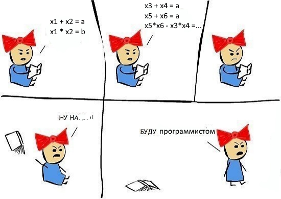

Я довольно долго пытался решить эту задачу математически,
но в итоге просто написал перебор, 2 раза воспользовавшись теоремой Виета, и получил

a = -22
b = 105

ИЛИ

a = -52
b = 640

Буду признателен, если расшарите официальное решение.

